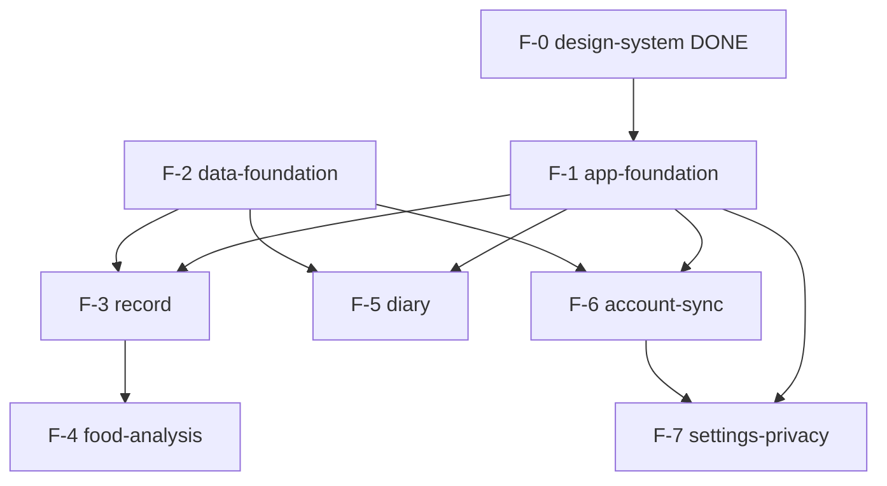

<!-- workflow-step: STEP-R6 | gate: GATE-0 | producer: ctx-aidlc-roadmap | condition: multi-feature prepared-requirement -->
# Feature Roadmap — (mymeal)

## 1. Source Document

- Source path: `aidlc-docs/_source-plan.md` (사용자 제공 실행 프롬프트 §3 스냅샷)
- Classification: prepared-requirement
- Received date: 2026-08-27
- Author (roadmap author): ctx-aidlc-roadmap (Claude) / 승인자: yts0646
- Depth Level: comprehensive

### 입력 검증 결과 (STEP R1)
- 빈 영역: 0 (목표/기능/정책/예외/외부연동/데이터모델 방향 모두 기술됨. 상세 정책 10건은 의도적으로 열어둠 — 피처별 GATE에서 결정)
- 모순: 1 — "단일 shared 모듈 우선" vs 기존 `:core:designsystem` Gradle 모듈(사용자 기승인, 구현·머지 완료) → F-1 ADR에서 유지/통합 결정 (Open Item #1)
- 미정의 용어: 없음 (K-FIND=식품안전나라 식품영양성분DB, LiteRT=구 TFLite 런타임 — 문맥 명확)
- ⚠️ RISK 태그: 없음. 단 외부 연동 3건(Supabase, K-FIND, MediaPipe/LiteRT/CoreML)은 규칙상 피처 분석에서 최소 P1로 취급

## 2. Feature List

| Feature ID | Slug | 1-line Responsibility | Type |
|------------|------|------------------------|------|
| F-0 | design-system | 디자인 토큰/테마 (SikdorokTheme) — **구현·머지 완료(2026-08-27)** | foundation-* (완료) |
| F-1 | app-foundation | shared feature-first 패키지 골격, Navigation, Koin DI 부트스트랩, ViewModel+StateFlow UDF 골격, Kermit 로깅, 얇은 Host 앱 조립 | foundation-* |
| F-2 | data-foundation | Room KMP 로컬 DB(meal_entries/meal_items), 이미지 파일 저장(경로/메타만 DB), 오프라인 우선 저장 계층 | foundation-* |
| F-3 | record | 기록 생성 플로우: 촬영/사진 선택(expect/actual), 음식 항목·섭취량·메모·시각 입력, 로컬 저장 | domain-feature |
| F-4 | food-analysis | 온디바이스 음식 후보 추론(공통 인터페이스+플랫폼 Adapter), K-FIND 영양 데이터 연동, 예상 칼로리 계산, 수동 fallback 연계 | domain-feature |
| F-5 | diary | 날짜별 캘린더/타임라인, 기록 상세·수정·삭제, 재실행 후 복원 조회 | domain-feature |
| F-6 | account-sync | Supabase Auth/Postgres/Storage/RLS 잠정 검증·확정 ADR, 동기화 상태·충돌·삭제 전파, 이미지 리사이즈·업로드 | integration |
| F-7 | settings-privacy | 설정 화면, 사진·기록·계정 데이터 삭제 경로, 개인정보/동의(Analytics 결정 포함) | domain-feature |

규칙 준수: 슬러그 kebab-case, 피처당 단일 도메인, foundation 선행 배치. F-0은 기완료 자산으로 분해 대상 아님.

## 3. Resource Matrix

| Resource | Type | F-1 | F-2 | F-3 | F-4 | F-5 | F-6 | F-7 | ⚠ |
|----------|------|-----|-----|-----|-----|-----|-----|-----|---|
| shared/commonMain core/* 패키지 골격 | module | 생성 | | | | | | | |
| Navigation graph/조립 지점 | component | 생성·소유 | | dest 추가 | | dest 추가 | | dest 추가 | ⚠ |
| Koin DI 루트 구성 | component | 생성·소유 | module 기여 | module 기여 | module 기여 | module 기여 | module 기여 | module 기여 | ⚠ |
| App 루트(테마·DI·Nav 조립) | component | 소유 | | | | | | | |
| Room DB 스키마(meal_entries/meal_items) | table | | 생성·소유 | 쓰기 | | 읽기·쓰기 | migration 확장 | 삭제 | ⚠ |
| 로컬 이미지 파일 저장소 | component | | 생성·소유 | 쓰기 | 읽기 | 읽기 | 읽기(업로드) | 삭제 | ⚠ |
| SikdorokTheme (:core:designsystem) | module | 소비 | | 소비 | 소비 | 소비 | | 소비 | |
| 카메라/PhotoPicker Adapter | component | | | 생성·소유 | | | | | |
| AI 추론 Adapter(expect/actual) | component | | | | 생성·소유 | | | | |
| K-FIND 영양 데이터 소스 | api | | | | 생성·소유 | | | | |
| Supabase 클라이언트/Auth | api | | | | | | 생성·소유 | 소비(탈퇴) | ⚠ |
| 동기화 상태 필드/큐 | table | | | | | | 생성·소유 | | |

### ⚠ 해소 (STEP R4 결과)
| ⚠ Resource | Resolution |
|------------|------------|
| Navigation graph | single-owner **F-1** — F-1이 골격·조립 소유, 각 피처는 자기 destination 등록 함수만 노출 (feature 간 직접 참조 금지 규칙으로 충돌 차단) |
| Koin DI 구성 | single-owner **F-1** — 루트는 F-1, 피처는 자기 Koin module 파일만 기여 (파일 단위 분리로 병렬 안전) |
| Room DB 스키마 | single-owner **F-2** — 스키마·DAO는 F-2 소유. F-3/F-5/F-7은 DAO 소비만. F-6의 동기화 필드는 F-6이 migration으로 확장하되 F-2 산출물 선행 필수 |
| 로컬 이미지 저장소 | single-owner **F-2** — 저장/조회/삭제 API를 F-2가 소유, 나머지는 소비 |
| Supabase 클라이언트 | single-owner **F-6** — F-7 탈퇴는 F-6의 공개 API만 소비 (직렬화: F-7은 F-6 이후) |

foundation 추출: F-1/F-2가 그 역할. 추가 foundation 추출 불필요.

## 4. Dependency Graph

### 4-1. Inter-Feature Dependencies

| Source Feature | Depends On | Reason | Resolution |
|----------------|------------|--------|------------|
| F-1 | F-0 | 테마 소비 (기완료 — 대기 없음) | foundation-extracted |
| F-3 | F-1, F-2 | 화면 골격/DI/Nav + 저장 계층 | serialized |
| F-4 | F-3 | record 플로우 내부 진입점에 통합 (문서 원칙: 초기엔 features/record 내부 책임) | serialized |
| F-5 | F-1, F-2 | 화면 골격 + DB 조회 | serialized |
| F-6 | F-1, F-2 | DI/설정 진입 + 스키마·이미지 저장소 확장 | serialized |
| F-7 | F-1, F-6 | 화면 골격 + 계정 탈퇴는 F-6 API 소비 | serialized |

### 4-2. Circular Dependency Check
- Circular dependency: **no** (단방향: F-0 → F-1/F-2 → F-3/F-5/F-6 → F-4/F-7)

### 4-3. Diagram

텍스트 대체: F-0(완료)→F-1. F-1과 F-2는 상호 독립. F-3/F-5/F-6은 F-1+F-2 완료 후. F-4는 F-3 이후. F-7은 F-1+F-6 이후.

## 5. Allocation Recommendation

### 5-1. Execution Order

| Phase | Feature(s) | Execution Mode | Notes |
|-------|-----------|-----------|------|
| 0 | F-0 design-system | 완료 | main 머지됨 (c450ced) |
| 1 | F-1 app-foundation ∥ F-2 data-foundation | parallel-capable | 파일 영역 비중첩 (F-1: core/ui·nav·di, F-2: data/local). 워크트리 분리 가능 |
| 2 | F-3 record ∥ F-5 diary | parallel-capable | 서로 다른 features/* 패키지. 단 수동 테스트는 record 데이터 선행이 편함 |
| 3 | F-4 food-analysis ∥ F-6 account-sync | parallel-capable | F-4는 record 내부 확장, F-6은 data/remote·sync — 영역 비중첩 |
| 4 | F-7 settings-privacy | serial | F-6 계정 API 필요 |

### 5-2. Division of Labor Recommendation

| Feature | Recommended Owner (role/skill) | Notes |
|---------|----------------------|------|
| F-1 | 본인 (Compose/Android 강점 그대로 활용) | Navigation ADR 포함 |
| F-2 | 본인 + kmp-module-structure 규칙 | Room KMP는 신규 학습 — 공식 문서 검증 필수 |
| F-3, F-5 | 본인 | 핵심 가치 플로우 |
| F-4 | 본인 + kmp-security/platform 가이드 | 추론 런타임·K-FIND 모두 외부 연동 — P0/P1 질문 다수 예상 |
| F-6 | 본인 + kmp-security | Supabase 잠정→확정 ADR. 비밀키/RLS 검증 필수 |
| F-7 | 본인 | 삭제·동의 정책은 policy 질문으로 인간 결정 |

1인 개발이므로 "병렬"은 워크트리/세션 병행 가능성을 의미함 (실행은 순차여도 무방).

### 5-3. Parallel Safety Notes
- Phase 1: `settings.gradle.kts`/`shared/build.gradle.kts`를 양쪽이 만질 수 있음 — 의존성 추가는 F-1이 대표 수행하고 F-2는 자기 라이브러리만 추가하도록 커밋 분리 권장.
- Phase 2~3: 같은 Koin 루트/Nav 골격 파일 수정 금지 (등록 함수 노출 규약 준수 시 충돌 없음).
- F-6의 Room migration은 F-2 스키마 버전에 종속 — F-2 완료 전 시작 금지.

## 6. Handoff Plan

| Feature | Input Excerpt Location | Classification | Depends On (artifacts) |
|---------|---------------|------|--------------------|
| F-1 | `_source-plan.md` §기술 방향, §구조 설계 원칙, §디자인 입력 | prepared-requirement | 없음 (F-0 기완료) |
| F-2 | `_source-plan.md` §데이터 및 백엔드 방향(로컬), §MVP In Scope(저장·복원) | prepared-requirement | 없음 |
| F-3 | `_source-plan.md` §핵심 흐름 1-2·5·7, §MVP In Scope | prepared-requirement | F-1, F-2의 technical-design.md |
| F-4 | `_source-plan.md` §AI 및 칼로리 정책, §핵심 흐름 3-6 | prepared-requirement | F-3의 technical-design.md |
| F-5 | `_source-plan.md` §핵심 흐름 8, §MVP In Scope(캘린더·상세) | prepared-requirement | F-1, F-2의 technical-design.md |
| F-6 | `_source-plan.md` §데이터 및 백엔드 방향, §핵심 흐름 9, 열어둔 결정 1·2·3·8 | prepared-requirement | F-2의 technical-design.md (스키마) |
| F-7 | `_source-plan.md` §품질·보안(삭제·탈퇴), 열어둔 결정 10 | prepared-requirement | F-6의 technical-design.md (계정 API) |

## 7. Open Items

- [ ] #1 `:core:designsystem` Gradle 모듈 유지 vs shared 내 패키지 통합 — F-1 technical-design ADR에서 결정 (기존 사용자 승인 자산이므로 기본값: 유지)
- [ ] #2 열어둔 결정 10건 — 각 담당 피처의 STEP 4 질문으로 이관 (F-1: Nav 버전·최소 OS / F-4: confidence·AI 범위·영양 데이터 방식 / F-6: 로그인·백업·충돌·SDK / F-7: Analytics 동의)
- [ ] #3 Figma 화면 노드(721-11215) 분석 — F-1(화면 골격 파악)과 각 화면 피처에서 kmp-figma-to-code 규칙으로 수행. 접근 불가 시 Export 요청

## 8. GATE-0 Review Pointers

- 피처 분해가 책임 단위로 적절한가 (8개 중 1개 기완료, 이종 도메인 혼합 없음)
- ⚠ 공유 리소스 5건 전부 해소되었는가 (§3 해소 표)
- 순환 의존 없음 확인 (§4-2)
- 병렬/직렬 구분 (§5-1, 1인 개발 주석 포함)
- 슬러그 kebab-case 준수
- `aidlc-state.md` 동기화 여부
